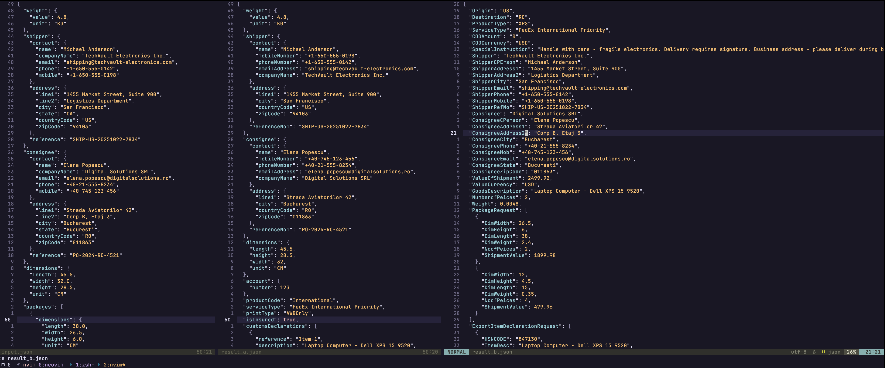

# Axiogate


Service that maps provider shipment requests to actual carriers.

### How to run this locally?

Make sure to have the migration tool installed. (Before, running any `make` command sure to have `go` and `docker` installed)

```bash
 go install -tags 'postgres pgx' github.com/golang-migrate/migrate/v4/cmd/migrate@latest
```

Start all dependencies from docker compose
```bash
docker compose up -d
```

Make sure now to run migrate command, to setup the db.
```bash
make migrate-up
```

Build and run the Service

```bash
make build && ./axiogate
```

In another terminal or `TMUX` pane, run any of the `curl` commands to test this. This only work for provider `a` and `b`.

```bash 

curl -XPOST --data @input.json 'localhost:8080/api/v1/createShipping'

curl -XPOST --data @input.json 'localhost:8080/api/v1/createShipping?providers=b'

curl -XPOST --data @input.json 'localhost:8080/api/v1/createShipping?providers=a'

curl -XPOST --data @input.json 'localhost:8080/api/v1/createShipping?providers=a&providers=b'
```


### How can I see what's in the DB?

In another terminal use `psql` to connect. If you don't have it installed, please install it. Make sure you stil have your DB instance from docker compose running.

```bash
PGPASSWORD="postgres" psql -h localhost -p 5432 -U postgres postgres
``` 

#### Example 

```sql
postgres=# select * from shipment;
 id | provider |               payload
----+----------+--------------------------------------
  1 | b        | {"another": "test", "from-api": "b"}
  2 | a        | {"another": "test", "from-api": "a"}
  3 | a        | {"another": "test", "from-api": "a"}
  4 | b        | {"another": "test", "from-api": "b"}
  5 | a        | {"another": "test", "from-api": "a"}
  6 | b        | {"another": "test", "from-api": "b"}
  7 | a        | {"another": "test", "from-api": "a"}
  8 | b        | {"another": "test", "from-api": "b"}
  9 | a        | {"another": "test", "from-api": "a"}
 10 | b        | {"another": "test", "from-api": "b"}
(10 rows)
```


### What if I want to review how the mapping conversions are done from in and to provider A and B?

Well I got that sorted, there are two files, input.json -> which satisfies api.ShippingRequest and there are A.json and B.json I just copy pasted from the logs, remove escape chars and formatted.

### Comparison


